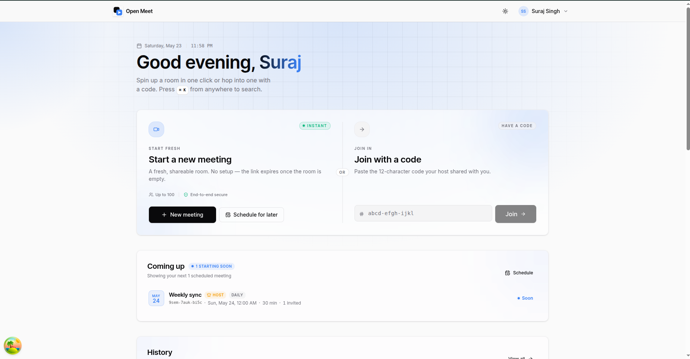

<div align="center">


# Open Meet

**OpenMeet is an open-source, self-hostable video conferencing platform, a privacy-friendly alternative to Google Meet and Zoom. Create or join meetings using a code, communicate over low-latency WebRTC, and collaborate with real-time chat, reactions, and host moderation controls.**

<sub>Full-stack TypeScript · LiveKit SFU · multi-instance ready</sub>

<p>
  
  
  
  
  
  
  
</p>

[Highlights](#highlights) · [Stack](#stack) · [Quick start](#quick-start) · [Testing](#testing)

<br/>



</div>

---

## Highlights

- **Instant rooms** — one-click `xxxx-xxxx-xxxx` meeting codes with room-scoped, short-lived JWT tokens.
- **Real pre-join lobby** — camera preview, device pickers, mic level meter, and persisted defaults.
- **Realtime chat** — Socket.IO `/meeting` namespace fanned out via Redis adapter, so the API scales horizontally.
- **Reactions & raise hand** — live overlay reactions and raised-hand indicators in tiles and the participants panel.
- **Hardened auth** — `argon2` hashing, httpOnly access + refresh cookies, rotation hashed in Redis, throttled `/api/auth/*`.
- **Typed end-to-end** — one shared `@open-meet/types` package for DTOs, socket events, and the response envelope.
- **Localized** — full UI + API i18n via `next-intl` (web/admin, URL-prefixed locales) and `nestjs-i18n` (server). English is the source of truth; `pnpm i18n:verify` keeps every locale in lockstep.
- **Tested** — Vitest unit suites for services and repositories, plus Supertest API e2e over the live HTTP layer.
- **Self-hostable** — Postgres, Redis, LiveKit, and coturn all wired up in `docker-compose.yml`.

## Stack

- **Frontend** — Next.js 15 · React 19 · Tailwind v4 · shadcn/ui · TanStack Query v5 · Zustand v5
- **Backend** — NestJS 11 (Fastify) · Prisma 6 · `@nestjs/jwt` + argon2 · BullMQ v5
- **Realtime** — LiveKit SFU · `@livekit/components-react` · Socket.IO `/meeting` (Redis adapter)
- **i18n** — `next-intl` (web/admin) · `nestjs-i18n` (server) · **English** (base) + **Arabic** (RTL)
- **Infra** — PostgreSQL 16 · Redis 7 · coturn · MailHog · Docker Compose
- **Tooling** — pnpm workspaces · Turborepo v2 · Vitest + Supertest · ESLint 9 · Prettier 3

## Quick start

> **Prerequisites** — Node 22 LTS · pnpm ≥ 9 · Docker Desktop (running).

```bash
./setup.sh      # generate secrets + env files, start infra, run migrations
pnpm dev        # api · web · admin
```

| Service            | URL                              |
| ------------------ | -------------------------------- |
| Web (user app)     | <http://localhost:3000>          |
| Admin console      | <http://localhost:3001>          |
| API docs (Swagger) | <http://localhost:3002/api/docs> |

`setup.sh` is idempotent — re-running keeps your existing secrets. The default admin is created on first API boot from `DEFAULT_ADMIN_*` in `apps/server/.env`. Run it as your normal user, **never with `sudo`** (sudo uses root's Node and writes root-owned files).

<details>
<summary><b>What <code>setup.sh</code> writes &amp; its flags</b></summary>

<br/>

It generates four env files, all gitignored:

| File                    | Read by                 | Holds                                                                                |
| ----------------------- | ----------------------- | ------------------------------------------------------------------------------------ |
| `apps/server/.env`      | NestJS API              | JWT + LiveKit secrets, DB/Redis URLs, `DEFAULT_ADMIN_*`                              |
| `apps/web/.env.local`   | Web app                 | `NEXT_PUBLIC_*` public vars                                                          |
| `apps/admin/.env.local` | Admin console           | `NEXT_PUBLIC_*` public vars                                                          |
| `.env` (repo root)      | Docker Compose **only** | Mirrors `LIVEKIT_API_KEY` + `LIVEKIT_API_SECRET` for the LiveKit & Egress containers |

Flags:

| Flag             | Effect                                                                 |
| ---------------- | ---------------------------------------------------------------------- |
| `--force`        | Regenerate every secret and **reset the database** (drops all tables). |
| `--skip-install` | Skip `pnpm install`.                                                   |
| `--skip-docker`  | Skip `docker compose up` (infra already running).                      |
| `--skip-db`      | Skip Prisma generate + migrate.                                        |

Every env var is documented in the `.env.example` files and validated by `apiEnvSchema` / `webPublicEnvSchema` in `packages/config/src/env.ts`.

</details>

<details>
<summary><b>How LiveKit credentials work (and why the root <code>.env</code> exists)</b></summary>

<br/>

LiveKit auth is a **key : secret** pair:

- **`devkey` (key name)** — a non-secret identifier that LiveKit embeds in every room token. It must be identical in `webhook.api_key` (`docker/livekit.yaml`), `LIVEKIT_API_KEY` (`apps/server/.env` + root `.env`), and the key Compose injects via `LIVEKIT_KEYS`. `scripts/setup/config.sh` pins it so it can't drift.
- **`LIVEKIT_API_SECRET`** — the real credential. `setup.sh` generates a random one; it signs and verifies tokens and webhook signatures. Only this rotates.

The repo-root `.env` is **not** secret storage — it only feeds Docker Compose's `${LIVEKIT_API_SECRET}` interpolation so the LiveKit & Egress containers run with the _same_ secret as the API. Delete it and Compose falls back to the literal `secret` default, which then mismatches the API and breaks tokens/webhooks — so keep it.

</details>

<details>
<summary><b>Reset &amp; database commands</b></summary>

<br/>

> **No undo** — these drop every table. Run `pg_dump` first if the data matters.

`./setup.sh --force` gives a clean slate: it regenerates all secrets, overwrites `apps/server/.env` + `apps/web/.env.local`, runs `prisma migrate reset` (drops meetings · messages · users · admins · recordings), and recreates the LiveKit containers so they pick up the new secret.

```bash
pnpm db:reset     # interactive — prisma confirms before dropping
pnpm db:wipe      # non-interactive — drops + re-applies immediately
pnpm db:studio    # Prisma Studio at http://localhost:5555
```

All wrap `prisma migrate reset --skip-seed`. The default admin is re-created from `DEFAULT_ADMIN_*` on the next API start.

</details>

## Testing

```bash
pnpm --filter @open-meet/server test       # Vitest unit — services · repositories · guards · pipes · gateway
pnpm --filter @open-meet/server test:e2e   # Supertest API e2e (needs a test Postgres + Redis)
```

---

<div align="center">
<sub>Made with ❤️ in TypeScript · MIT licensed</sub>
</div>
