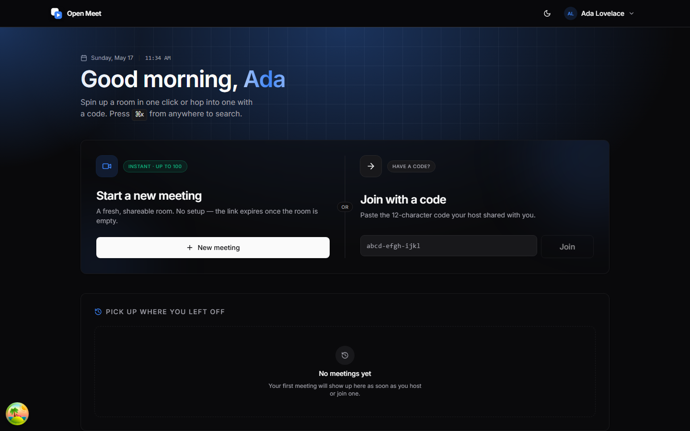
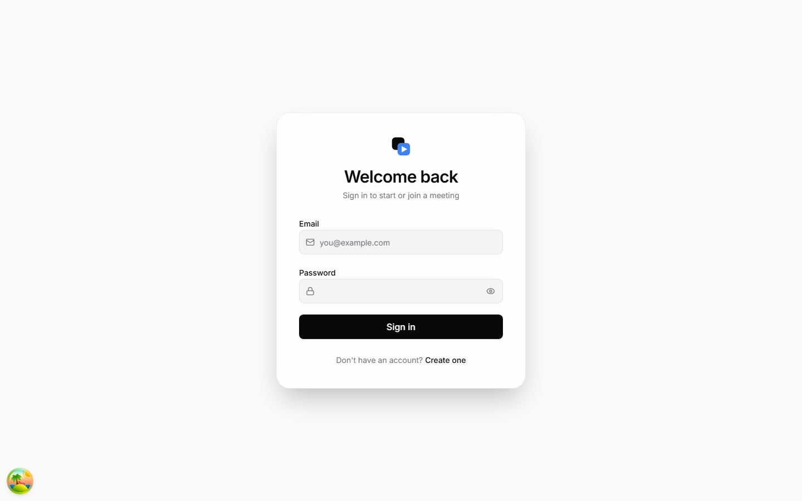
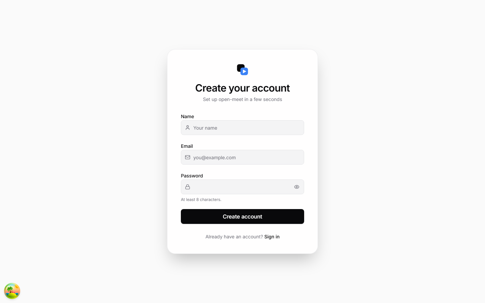
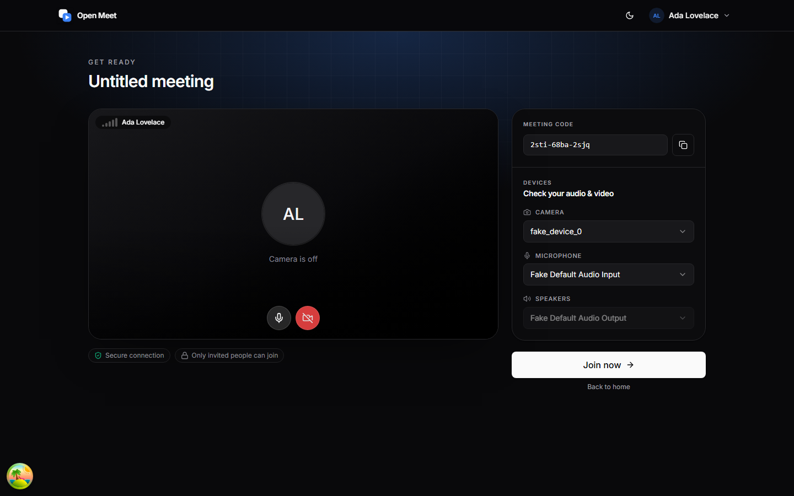
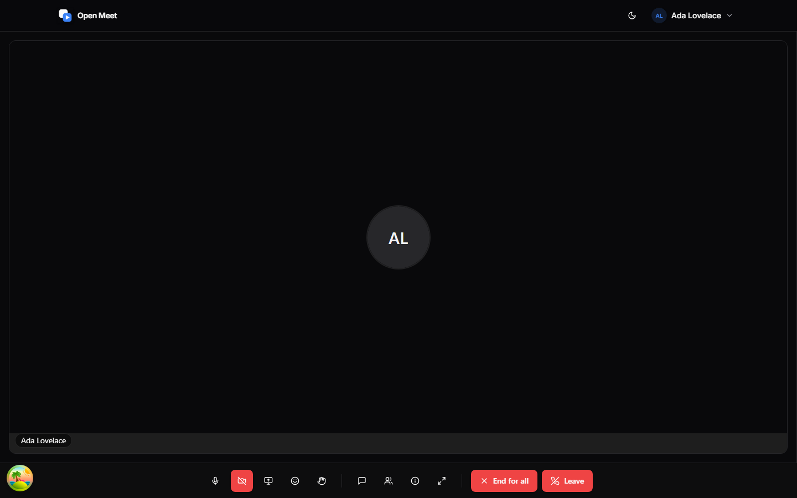
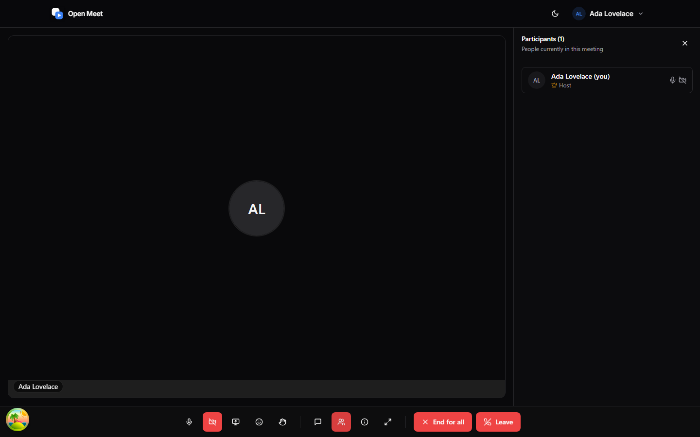
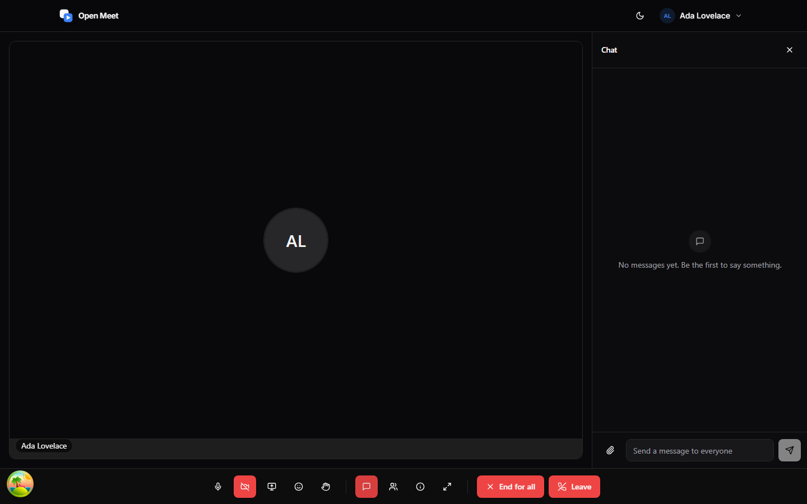

<div align="center">

# 🎥 Open Meet

**Self-hostable, real-time video conferencing for distributed teams.**
Full-stack TypeScript · LiveKit SFU · multi-instance ready.

<sub>
  
  
  
  
  
  
  
</sub>

<br/>



</div>

---

## ✨ Highlights

|                               |                                                                                                                           |
| ----------------------------- | ------------------------------------------------------------------------------------------------------------------------- |
| 🚀 **Instant rooms**          | One-click `xxxx-xxxx-xxxx` meeting codes, room-scoped JWT tokens, host transfer on the way.                               |
| 🎛️ **Real pre-join**          | Lobby with camera preview, device pickers, mic level meter, and persisted defaults.                                       |
| 💬 **Realtime chat**          | Socket.IO `/meeting` namespace, fanned out via `@socket.io/redis-adapter` so the API scales horizontally.                 |
| ✋ **Reactions & raise hand** | Live overlay reactions, raised-hand indicator surfaced in tiles and the participants panel.                               |
| 🔐 **Hardened auth**          | `argon2` hashing, httpOnly access + refresh cookies, refresh-token rotation hashed in Redis, throttling on `/api/auth/*`. |
| 🧰 **Typed end-to-end**       | One `@open-meet/types` package shared between API + Web for DTOs, socket events, and response envelopes.                  |
| 🧪 **Tested**                 | Vitest unit suites for services + repositories, Playwright E2E for every user-visible flow.                               |
| 📦 **Self-hostable**          | Bring-your-own Postgres, Redis, LiveKit, coturn — all wired in `docker-compose.yml`.                                      |

---

## 🧭 Tour

<table>
  <tr>
    <td width="50%"></td>
    <td width="50%"></td>
  </tr>
  <tr>
    <td><b>Sign in</b><br/><sub>Cookies-based JWT (15 m access · 7 d refresh). Refresh rotates on use.</sub></td>
    <td><b>Sign up</b><br/><sub>Zod-validated form. <code>argon2</code> hashed at rest.</sub></td>
  </tr>
  <tr>
    <td colspan="2"></td>
  </tr>
  <tr>
    <td colspan="2"><b>Dashboard</b><br/><sub>One-click meeting create, code-to-join field, history rail.</sub></td>
  </tr>
  <tr>
    <td></td>
    <td></td>
  </tr>
  <tr>
    <td><b>Lobby</b><br/><sub>Camera preview, device pickers, mic level, persisted defaults. Camera-off shows your avatar.</sub></td>
    <td><b>Meeting</b><br/><sub><code>useTracks([Camera, ScreenShare])</code> grid with raised-hand badges and reactions overlay.</sub></td>
  </tr>
  <tr>
    <td></td>
    <td></td>
  </tr>
  <tr>
    <td><b>Participants</b><br/><sub>Host crown, mic/camera state per-participant, raised-hand indicator.</sub></td>
    <td><b>Chat</b><br/><sub>WS-backed, persisted to Postgres, history rehydrates on rejoin.</sub></td>
  </tr>
</table>

---

## 🚀 Quick start

```bash
# 1 · install
pnpm install

# 2 · spin up infra (postgres, redis, livekit, coturn, mailhog)
docker compose up -d

# 3 · apply schema
pnpm --filter @open-meet/server prisma:migrate dev --name init

# 4 · run both apps
pnpm dev
```

Open **<http://localhost:3000>** → register → **New meeting**. Swagger lives at **<http://localhost:3001/api/docs>**.

> Requires **Node 22 LTS**, **pnpm ≥ 9**, **Docker Desktop**. Dev defaults are committed; copy `.env.example` → `.env` per app to customise.

---

## 🧪 Testing

```bash
pnpm --filter @open-meet/server test                  # vitest — services, repositories, guards
pnpm --filter @open-meet/e2e install:browsers         # one-time Playwright deps
pnpm --filter @open-meet/e2e test                     # unit + browser e2e
pnpm --filter @open-meet/e2e screenshots              # regenerate docs/screenshots/*
```

---

<div align="center">
<sub>Built with TypeScript end-to-end. MIT licensed.</sub>
</div>
